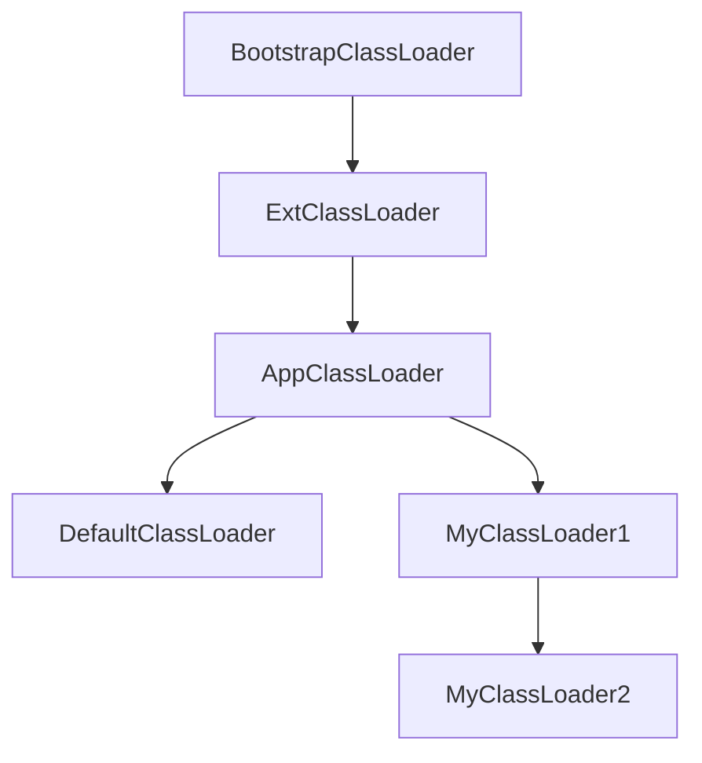

# 简述

参考 cglib BeanCopier 编写出来的对象拷贝工具，相比 cglib BeanCopier，提供以下更多特性：

1. [X] 相同名称相同类型拷贝: `String` -> `String`
2. [X] 完全兼容的泛型拷贝: `StringValue` -> `Value<String>`
3. [X] 嵌套拷贝，集合嵌套拷贝: `Source` -> `Source`, `List<Source>` -> `Collection<Target>`
4. [X] 向上转型拷贝: `Integer` -> `Number`, `ArrayList<Integer>` -> `List<Number>`
5. [X] 拷贝父类字段
6. [X] 字段别名: `@Property(value = "aliasName")`
7. [X] 忽略字段: `@Property(skip = true)`

**相比 cglib，本项目提供的对象拷贝工具可以拷贝 `setter` 返回值不是 `void` 的字段，因此兼容 `lombok`
的 `@Accessors(chain = true)`**

# 使用方式

```xml

<dependency>
    <!-- https://mvnrepository.com/artifact/io.github.tanyaofei/beancopier -->
    <groupId>io.github.tanyaofei</groupId>
    <artifactId>beancopier</artifactId>
    <version>0.1.4</version>
</dependency>
```

# 性能对比

| 拷贝工具             | 拷贝一百万个对象耗时 |
|------------------|------------|
| **BeanCopier**   | **17ms**   |
| cglib BeanCopier | 20ms       |
| BeanUtils        | 1387ms     |
| ModelMapper      | 4262ms     |

# 使用

## 简单使用

```java
import io.github.tanyaofei.beancopier.BeanCopier;
import lombok.Data;
import lombok.experimental.Accessors;

@Data
@Accessors(chain = true)
public class A {
   private String a;
   private Integer b;
   private Long c;
   private String d;
}

@Data
@Accessors(chain = true)
public class B {
   private String a;
   private Integer b;
   private Long c;
   private String d;
}

public class Main {

   public static void main(String[] args) {
      A a = new A();
      // ... set fields
      B b = BeanCopier.copy(a, B.class);
      assertEquals(a.getA(), b.getA());
      assertEquals(a.getB(), b.getB());
      assertEquals(a.getC(), b.getC());
      assertEquals(a.getD(), b.getD());
   }

}
```

## 嵌套拷贝

```java
import io.github.tanyaofei.beancopier.BeanCopier;
import lombok.Data;
import lombok.experimental.Accessors;


@Data
@Accessors(chain = true)
public class Node {
   private Node child;
   private List<Node> children;
   private String string;
}

@Data
@Accessors(chain = true)
public class Node2 {
   private Node2 child;
   private List<Node2> children;
   private String string;
}

public class Main {

   public static void main(String[] args) {
      Node n1 = new Node();
      // ... set fields
      Node2 n2 = BeanCopier.copy(n1, Node2.class);
      assertEquals(n1.getChild().getString(), n2.getChild().getString());
      for (int i = 0; i < n1.getChildren().size(); i++) {
         assertEquals(n1.getChildren().get(i).getString(), n2.getChildren().get(i).getString());
      }
   }

}
```

## 向上转型拷贝

在这个例子中

+ `Integer` -> `Number`
+ `ArrayList<String>` -> `List<String>`
+ `List<Integer>` -> `List<? extends Number>`

```java
import io.github.tanyaofei.beancopier.BeanCopier;
import lombok.Data;
import lombok.experimental.Accessors;

import java.util.ArrayList;

@Data
@Accessors(chain = true)
public class A {
   private Integer a;
   private ArrayList<String> b;
   private List<Integer> c;
}

@Data
@Accessors(chain = true)
public class B {
   private Number a;
   private List<String> b;
   private List<? extends Number> c;
}

public class Main {
   public static void main(String[] args) {
      A a = new A();
      // ... set fields
      B b = BeanCopier.copy(a, B.class);
      assertEquals(a.getA(), b.getA());
      assertEquals(a.getB(), b.getB());
      assertEquals(a.getC(), b.getC());
   }
}
```

## 继承字段拷贝

```java
import io.github.tanyaofei.beancopier.BeanCopier;
import lombok.Data;
import lombok.EqualsAndHashCode;
import lombok.experimental.Accessors;


@Data
@Accessors(chain = true)
public class Parent {
   private String a;
}

@Data
@Accessors(chain = true)
@EqualsAndHashCode(callSuper = true)
public class Child extends Parent {
   private String b;
}

@Data
@Accessors(chain = true)
@EqualsAndHashCode(callSuper = true)
public class Child2 extends Parent {
   private String b;
}

public class Main {
   public static void main(String[] args) {
      Child child = new Child();
      // ... set fields
      Child2 child2 = BeanCopier.copy(child, Child2.class);
      assertEquals(child.getA(), child2.getA());
      assertEquals(child.getB(), child2.getB());
   }
}
```

## 字段别名

使用 `@Property(value = "xxx")` 为字段指定别名
<p><b>当使用别名时，在拷贝时不再拷贝同字段名称的同类型字段，而是拷贝字段名称为别名的同类型字段</b></p>

```java
import io.github.tanyaofei.beancopier.annotation.Property;
import lombok.experimental.Accessors;
import lombok.Data;

public class Source {
  private String value;
}

public class Target {
  @Property("value")   // 从 Source 拷贝时使用 value 字段
  private String val;
}
```

## 跳过/不拷贝字段

使用 `@Property(skip = true)` 表示该字段不需要拷贝

```java
import io.github.tanyaofei.beancopier.annotation.Property;
import lombok.experimental.Accessors;
import lombok.Data;

@Data
@Accessors(chain = true)
public class Source {
  private String value1;
  private String value2;
}

@Data
@Accessors(chain = true)
public class Target {
  private String value1;
  @Property(skip = true) // 拷贝时跳过此字段, 因此为 null
  private String value2;
}
```

# 选择 ClassLoader

在 Java 中，不同的类加载器加载出来的类无法相互访问，但是具继承关系的类加载器可以访问父加载器加载的类。在 `beancopier`
中，生成出来的 `converter` 需要同时访问 `source` 和 `target`，由于 `source` 和 `target`
可能来自于不同的类加载器，因此 `beancopier` 使用的类加载器尤为重要。



在以上继承关系图中:

1. `MyClassLoader1` 无法访问 `DefaultClassLoader` 和 `MyClassLoader2`
2. `DefaultClassLoader` 无法访问 `MyClassLoader1` 和 `MyClassLoader2`
3. `MyClassLoader2` 可以访问 `MyClassLoader1`
4. 所有 `MyClassLoader` 都可以访问 `AppClassLoader`、`ExtClassLoader`、`BootstrapClassLoader`

`beancopier` 具有三种情况使用不同的 `ClassLoader`

+ `BeanCopier` 提供的静态方法在运行时会选取继承链中更加下层的类加载器，如果两个类加载器没有继承关系，则抛出异常。使用这种方式的原因是为了尽可能地覆盖更多场景。
+ 不提供 `classLoader` 的构造方法实例化的 `BeanCopierImpl` 会使用 `DefaultClassLoader`
  ，这个类加载器继承于 `AppClassLoader`
  。使用这种方式的原因是为了可以进行类卸载。
+ 构造方法中指定了 `classLoader` 参数实例化的 `BeanCopierImpl` 会使用指定的类加载器，但是分为两种情况:
    1. 如果该类加载器实现了 `ConverterClassLoader` 接口，则会调用该接口的 `defineClass(String, byte[])` 方法
    2. 如果该类加载器没有实现 `ConverterClassLoader`
       接口，则会反射调用该类加载器的 `defineClass(String, byte[], int, int)` 方法

# 类卸载

由于该工具会在运行时生成类, 开发者可斟酌是否需要进行类卸载来减少长期的内存占用。
如果需要类卸载能力的话应当避免直接使用 `BeanCopier` 提供的静态方法，而是通过 `new BeanCopierImpl()` 来使用。
当 `BeanCopierImpl` 实例被释放时，使用该实例生成的转换器对象，转换器类都会被 GC 掉。

```java
import io.github.tanyaofei.beancopier.BeanCopierImpl;

public class Main {
  public static void main(String[] args) {
    BeanCopierImpl beanCopier = new BeanCopierImpl();
    beanCopier.copy(new Object(), new Object());

    beanCopier = null;
    System.gc();
    // ... 
    // 在 GC 之后, Object -> Object 的转换器实例和类将会被清理掉
  }
}
```

# 版本记录

+ 0.1.5
  + 新增 `new BeanCopierImpl(builder -> builder.preferNested)` 等更多配置
  + **修复生成转换器时生成类名可能出现死循环的问题**
  + 更多预检测

+ 0.1.4
  + 支持通过 `new BeanCopierImpl(new MyClassLoader())` 创建指定类加载器的 `BeanCopierImpl`
  + `BeanCopier` 的类加载器由原来的 `ConverterClassLoader` 修改为自动选取
  + 修复集合嵌套拷贝元素包含 `null` 时会抛出异常的问题
  + 优化拷贝效率并减少内存占用
  + `asm` 依赖库升级到 `9.4`

+ 0.1.3
    + 大幅度优化批量拷贝的速度 `BeanCopier.cloneList()` 和 `BeanCopier.copyList()`, 拷贝一百万个对象由 `200ms+`
      缩减到 `20ms+`
    + 修复 `BeanCopier.cloneList` 第一个元素为 null 时会出现 `NullPointerException` 的 bug

+ 0.1.2
    + 除了提供 `BeanCopier` 的静态方法以外，现在可 `new BeanCopierImpl()` 来创建拷贝对象，适用于有类卸载需求的场景
    + 更多测试用例

+ 0.1.1
    + 修正一些 bug
    + 完全的泛型兼容, `List<Integer>` 现在可以拷贝到 `List<? extends Number>`, `IntegerBox extends Box<Integer>`
      现在可以拷贝到 `Box<Integer>`

+ 0.1.0
    + 新增 `@Property` 注解支持字段别名和跳过字段选项

[点击这里查看更多](./CHANGELOG.md)

## 调试

通过设置启动参数可以将生成出来的字节码文件写入到磁盘便于调试

```java
public class Main {
   public static void main(String[] args) {
      System.setProperty(BeanCopierConfiguration.PropertyNames.CONVERTER_CLASS_DUMP_PATH, "./");
   }
}
```

# 原理

该工具原理是在运行时反射获取两个对象的字段信息，并且根据字段信息使用 ASM 生成对应的转换器并缓存起来，之后都使用该转换器进行
get/set 拷贝

## 一些生成出来的 class 文件反编译后的源码

```java
public class StandardSourToStandardDestConverter$$GeneratedByBeanCopier$$ba69502d implements Converter<NormalTest.StandardSour, NormalTest.StandardDest> {
   public NormalTest.StandardDest convert(NormalTest.StandardSour var1) {
      NormalTest.StandardDest var2 = new NormalTest.StandardDest();
      var2.setA(var1.getA());
      var2.setB(var1.getB());
      var2.setC(var1.getC());
      var2.setD(var1.getD());
      var2.setE(var1.getE());
      var2.setF(var1.getF());
      var2.setG(var1.getG());
      var2.setH(var1.getH());
      var2.setI(var1.getI());
      var2.setJ(var1.getJ());
      var2.setK(var1.getK());
      var2.setL(var1.getL());
      return var2;
   }
}
```

```java
import java.util.List;

public class NestedSourToNestedDestConverter$$GeneratedByBeanCopier$$41d66bc9 implements Converter<NormalTest.NestedSour, NormalTest.NestedDest> {
  public NormalTest.NestedDest convert(NormalTest.NestedSour var1) {
    NormalTest.NestedDest var2 = new NormalTest.NestedDest();
    if (var1.getA() != null) {
      var2.setA(this.convert(var1.getA()));
    }

    if (var1.getB() != null) {
      var2.setB((List)var1.getB().stream().map((var1x) -> {
        return var1x == null ? null : this.convert(var1x);
      }).collect(Collectors.toList()));
    }

    var2.setC(var1.getC());
    var2.setD(var1.getD());
    return var2;
  }
}
```

