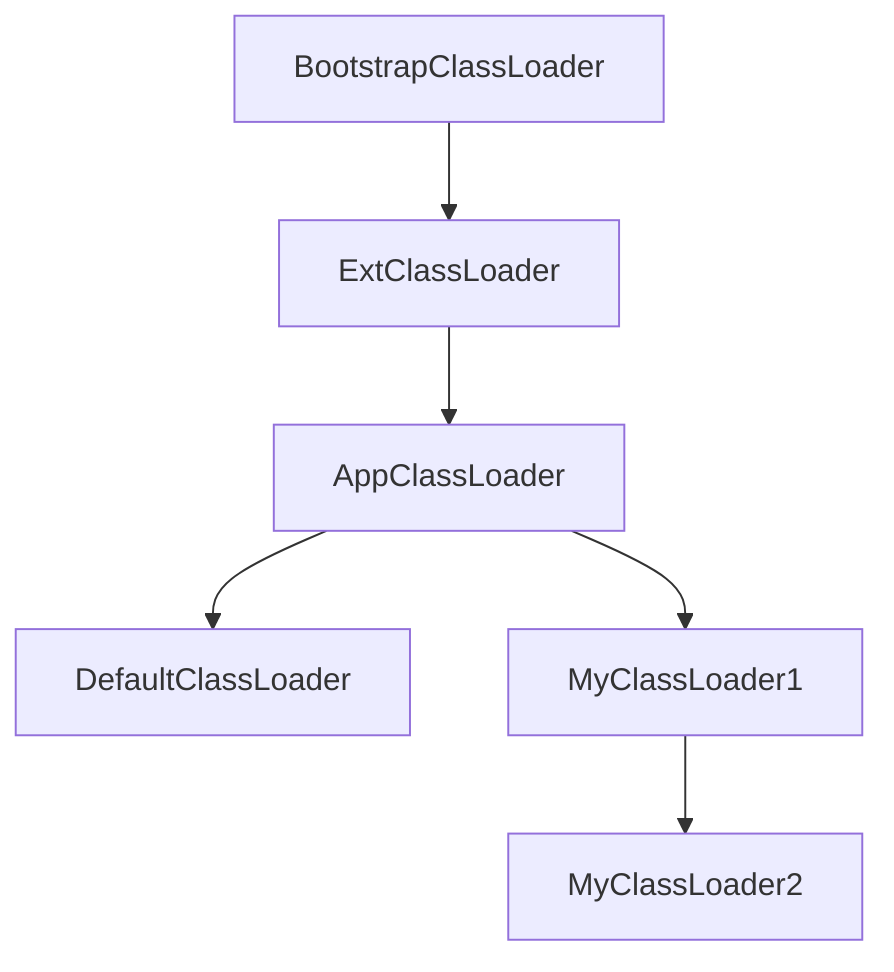

# 简述

参考 cglib BeanCopier 编写出来的对象拷贝工具，相比 cglib BeanCopier，提供以下更多特性：

1. [X] 相同名称相同类型拷贝
2. [X] 完全兼容的泛型拷贝: `StringValue` -> `Value<String>`, `Integer` -> `Number`, `List<Integer>` -> `Collection<? extends Number>`
3. [X] 嵌套拷贝，集合嵌套拷贝: `Source` -> `Source`, `List<Source>` -> `Collection<Target>`
4. [X] 拷贝父类字段
5. [X] 字段别名: `@Property(value = "aliasName")`
6. [X] 忽略字段: `@Property(skip = true)`
7. [X] **支持 JDK16 record** (包括 `POJO -> record`, `record -> POJO`, `record -> record`)

**相比 cglib，本项目提供的对象拷贝工具可以拷贝 `setter` 返回值不是 `void` 的字段，因此兼容 `lombok`
的 `@Accessors(chain = true)`**


# 引入到你的项目
**从 0.2.0 版本开始要求 JDK 最低为 17，如果低于此版本可使用 0.1.x 版本最低支持 JDK8**
```xml

<dependency>
    <!-- https://mvnrepository.com/artifact/io.github.tanyaofei/beancopier -->
    <groupId>io.github.tanyaofei</groupId>
    <artifactId>beancopier</artifactId>
    <version>x</version>
</dependency>
```

# 性能对比


| 拷贝工具             | 拷贝一百万个对象耗时 |
|------------------|------------|
| **BeanCopier**   | **27ms**   |
| cglib BeanCopier | 20ms       |
| BeanUtils        | 1387ms     |
| ModelMapper      | 4262ms     |

_注意：这个数据并不包含生成字节码的时间_

# 使用

### Source Bean
```java
class Menu {
  private Long id;
  private String name;
  private Menu parent;
  private List<Menu> sub;
}
```

### Target Bean

```java
import java.time.LocalDateTime;

record MenuDTO(
        Number id,                  // 类型兼容拷贝
        String name,                // 同名同类型拷贝
        MenuDTO parent,             // 嵌套拷贝
        Collection<MenuDTO> sub,    // 集合嵌套拷贝
        long createdAtTimestamp,    // 无同名字段, 不拷贝; 原始类型为零值
        LocalDateTime lastModified  // 无同名字段，不拷贝; 对象类型为 null
) {

}

```
接下来我们使用 `BeanCopier` 进行拷贝
```java
public class Test {
  public static void main(String[] args) {
    MenuDTO menuDTO = BeanCopier.copy(menu, MenuDTO.class);
    assertEquals(menu.getId(), menuDTO.id());
    assertEquals(menu.getName(), menuDTO.name());
    assertNotNull(menuDTO.parent());
    assertNoNull(menuDTO.sub());
    
    assertEquals(menuDTO.layer(), 0);
  }
}
```


# 可选配置项

通过以下方法可以创建一个自定义配置的 `BeanCopierImpl` 实例

```java
import io.github.tanyaofei.io.github.tanyaofei.beancopier.BeanCopierImpl;
import io.github.tanyaofei.io.github.tanyaofei.beancopier.NamingPolicy;

public class Test {
  public static void main(String[] args) {
    BeanCopierImpl beanCopier = new BeanCopierImpl(builder ->
            builder
                    .preferNested(true)
                    .includingSuper(true)
                    .skipNull(false)
                    .propertySupported(true)
                    .classLoader(ClassLoader.getSystemClassLoader())
                    .namingPolicy(NamingPolicy.getDefault())
                    .fullTypeMatching(false)
                    .classDumpPath("./target")
    );
  }
}
```

以下是可选的配置项

| 配置项                 | 默认值     | 作用                                           |
|---------------------|---------|----------------------------------------------|
| `preferNested`      | `true`  | 是否进行嵌套拷贝，如果嵌套拷贝包含循环引用，请勿使用                   |
| `skipNull`          | `false` | 是否跳过来源字段为 `null` 的字段，`false` 意味着目标字段的默认值不会生效 |
| `propertySupported` | `true`  | 是否启用对 `@Property` 注解的支持                      |
| `classloader`       | `null`  | 指定使用特定的类加载器对生成出来的转换器类进行加载                    |
| `fullTypeMatching`  | `false` | 是否严格完整匹配类型，为 `ture` 表示关闭向上转型、泛型兼容等字段的拷贝      |
| `classDumpPath`     | `null`  | 生成的转换器 class 文件导出位置                          |

# 选择 ClassLoader

在 Java 中，不同的类加载器加载出来的类无法相互访问，但是具继承关系的类加载器可以访问父加载器加载的类。在 `beancopier`
中，生成出来的 `converter` 需要同时访问 `source` 和 `target`，由于 `source` 和 `target`
可能来自于不同的类加载器，因此 `beancopier` 使用的类加载器尤为重要。



在以上继承关系图中:

1. `MyClassLoader1` 无法访问 `DefaultClassLoader` 和 `MyClassLoader2`
2. `DefaultClassLoader` 无法访问 `MyClassLoader1` 和 `MyClassLoader2`
3. `MyClassLoader2` 可以访问 `MyClassLoader1`
4.  `MyClassLoader`、`MyClassLoader2`, `DefaultClassLoader` 都可以访问 `AppClassLoader`、`ExtClassLoader`、`BootstrapClassLoader`

`beancopier` 具有三种情况使用不同的 `ClassLoader`

+ `BeanCopier` 提供的静态方法在运行时会选取继承链中更加下层的类加载器，如果两个类加载器没有继承关系，则抛出异常。使用这种方式的原因是为了尽可能地覆盖更多场景。
+ 不提供 `classLoader` 的构造方法实例化的 `BeanCopierImpl` 会使用 `DefaultClassLoader`
  ，这个类加载器继承于 `AppClassLoader`
  。使用这种方式的原因是为了可以进行类卸载。
+ 构造方法中指定了 `classLoader` 参数实例化的 `BeanCopierImpl` 会使用指定的类加载器，但是分为两种情况:
    1. 如果该类加载器实现了 `ConverterClassLoader` 接口，则会调用该接口的 `defineClass(String, byte[])` 方法
    2. 如果该类加载器没有实现 `ConverterClassLoader`
       接口，则会反射调用该类加载器的 `defineClass(String, byte[], int, int)` 方法

# 类卸载

由于该工具会在运行时生成类, 开发者可斟酌是否需要进行类卸载来减少长期的内存占用。
如果需要类卸载能力的话应当避免直接使用 `BeanCopier` 提供的静态方法，而是通过 `new BeanCopierImpl()` 来使用。
当 `BeanCopierImpl` 实例被释放时，使用该实例生成的转换器对象，转换器类都会被 GC 掉。

```java
import io.github.tanyaofei.io.github.tanyaofei.beancopier.BeanCopierImpl;

public class Main {
  public static void main(String[] args) {
    BeanCopierImpl beanCopier = new BeanCopierImpl();
    beanCopier.copy(new Object(), new Object());

    beanCopier = null;
    System.gc();
    // ... 
    // 在 GC 之后, Object -> Object 的转换器实例和类将会被清理掉
  }
}
```

# 版本记录

+ 0.2.0
  + 从这个版本开始要求最低版本为 JDK17
  + 添加对 JDK16 record 的支持
  + 添加 `module-info.java` 以支持 JDK9+ 的模块化
  + <b>BreakingChanges: </b> 
    + `@Property("aliasName")` 不会在拷贝来源和拷贝目标时同一个类时生效（这将会被认定是克隆对象）
    + 回调动作不再使用 `Callback` 而是使用 JDK 提供的 `BiConsumer`

+ 0.1.5
  + 新增 `new BeanCopierImpl(builder -> builder.preferNested)` 等更多配置
  + **修复生成转换器时生成类名可能出现死循环的问题**
  + 更多预检测

[点击这里查看更多](../../CHANGELOG.md)

## 调试

通过设置启动参数可以将生成出来的字节码文件写入到磁盘便于调试

```java
public class Main {
   public static void main(String[] args) {
      System.setProperty(BeanCopierConfiguration.PropertyNames.CONVERTER_CLASS_DUMP_PATH, "./");
   }
}
```

# 原理

该工具原理是在运行时反射获取两个对象的字段信息，并且根据字段信息使用 ASM 生成对应的转换器并缓存起来，之后都使用该转换器进行
get/set 拷贝

## 一些生成出来的 class 文件反编译后的源码

```java
package io.github.tanyaofei.beancopier.converter;

import io.github.tanyaofei.beancopier.converter.Converter;
import io.github.tanyaofei.beancopier.test.simple.SimplePOJO;
import java.time.LocalDateTime;

// $FF: synthetic class
public class SimpleObjectToSimpleObjectConverter$$GeneratedByBeanCopier$$5de41a00 implements Converter<SimpleObject, SimpleObject> {
  public SimpleObject convert(SimpleObject var1) {
    if (var1 == null) {
      return null;
    } else {
      Boolean var2 = var1.getBooleanVal();
      Byte var3 = var1.getByteVal();
      Short var4 = var1.getShortVal();
      Integer var5 = var1.getIntVal();
      Long var6 = var1.getLongVal();
      Float var7 = var1.getFloatVal();
      Double var8 = var1.getDoubleVal();
      Character var9 = var1.getCharVal();
      String var10 = var1.getStringVal();
      LocalDateTime var11 = var1.getLocalDateTimeVal();
      SimpleObject var12 = new SimpleObject();
      var12.setBooleanVal(var2);
      var12.setByteVal(var3);
      var12.setShortVal(var4);
      var12.setIntVal(var5);
      var12.setLongVal(var6);
      var12.setFloatVal(var7);
      var12.setDoubleVal(var8);
      var12.setCharVal(var9);
      var12.setStringVal(var10);
      var12.setLocalDateTimeVal(var11);
      return var12;
    }
  }
}
```

```java
package io.github.tanyaofei.beancopier.converter;

import io.github.tanyaofei.beancopier.converter.Converter;
import io.github.tanyaofei.beancopier.test.nested.NestedRecord;
import java.util.List;

// $FF: synthetic class
public class NestedRecordToNestedRecordConverter$$GeneratedByBeanCopier$$6888e1c0 implements Converter<NestedRecord, NestedRecord> {
  public NestedRecord convert(NestedRecord var1) {
    if (var1 == null) {
      return null;
    } else {
      int var2 = var1.seniority();
      NestedRecord var3 = var1.child();
      List var4 = var1.children();
      NestedRecord var5 = new NestedRecord(var2, var3, var4);
      return var5;
    }
  }
}

```

